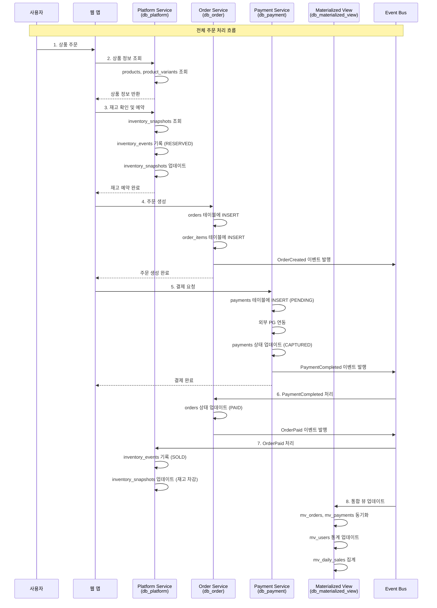
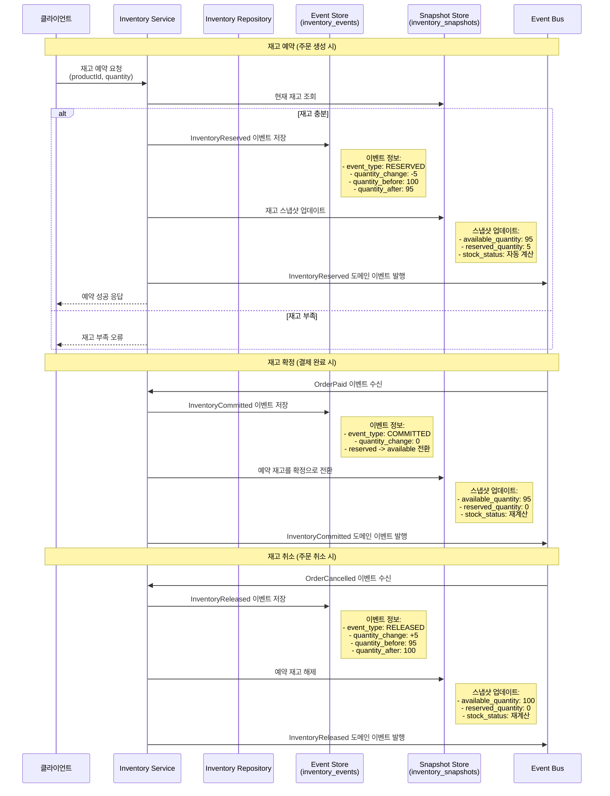
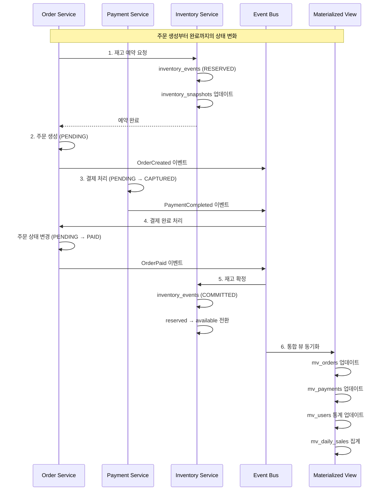
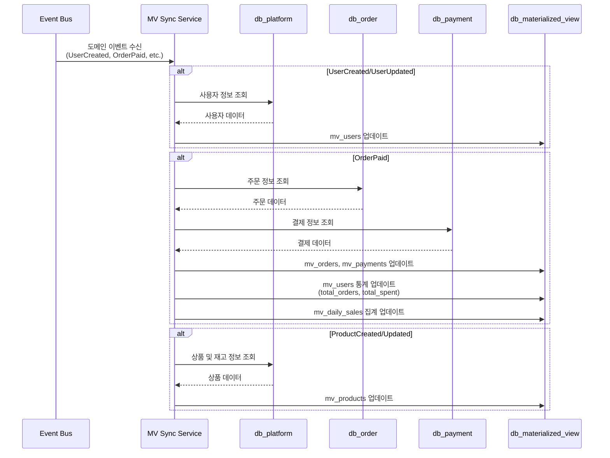
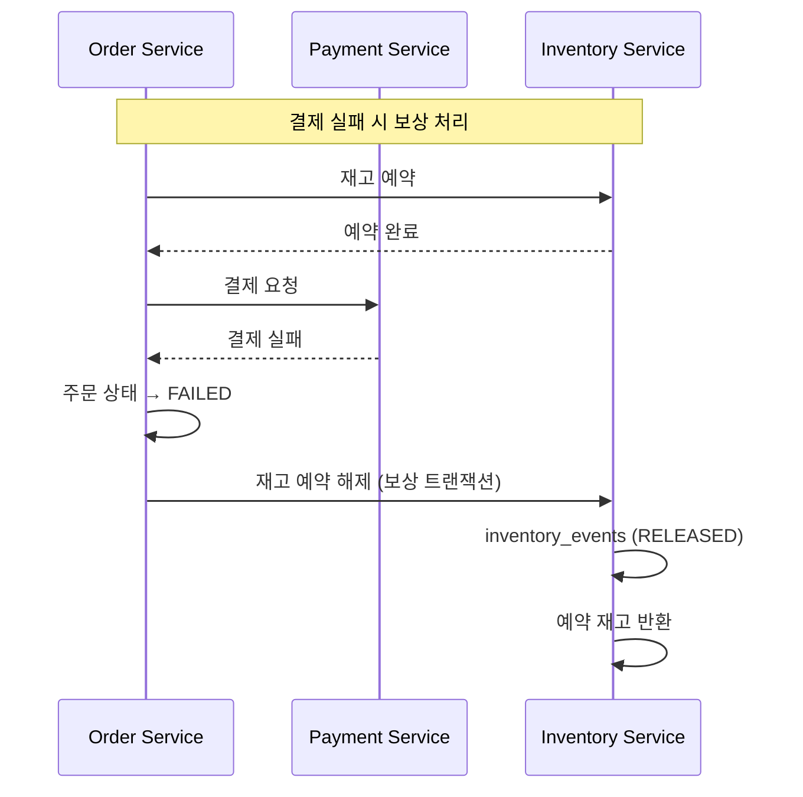

# MSA Commerce Lab - 데이터 흐름 분석

## 아키텍처 개요

이 시스템은 마이크로서비스 아키텍처를 기반으로 한 전자상거래 플랫폼으로, 다음과 같은 데이터베이스로 구성되어 있습니다:

- **db_platform**: 사용자, 상품, 카테고리, 재고 관리
- **db_order**: 주문 관리 및 주문 항목
- **db_payment**: 결제 처리 및 결제 상태 관리
- **db_materialized_view**: 통합 뷰 및 리포팅용 읽기 최적화 데이터

## 1. 전체 데이터 흐름 시퀀스



## 2. Inventory System 상세 흐름

### 2.1 재고 시스템 아키텍처

재고 시스템은 **Event Sourcing 패턴**과 **CQRS (Command Query Responsibility Segregation)**를 적용하여 설계되었습니다.

#### 핵심 테이블 구조

1. **inventory_snapshots**: 현재 재고 상태 (Command Side)
2. **inventory_events**: 재고 변경 이벤트 저장 (Event Store)

### 2.2 재고 관리 시퀀스 다이어그램



### 2.3 재고 시스템 상세 설명

#### Event Sourcing 적용

**inventory_events 테이블**은 재고와 관련된 모든 변경 사항을 이벤트로 저장합니다:

```sql
CREATE TABLE inventory_events (
    id                      BIGINT AUTO_INCREMENT PRIMARY KEY,
    event_type              VARCHAR(50) NOT NULL,        -- RESERVED, COMMITTED, RELEASED, ADJUSTED
    aggregate_id            VARCHAR(255) NOT NULL,       -- product_id-variant_id-location 조합
    aggregate_version       BIGINT NOT NULL,             -- 버전 관리로 동시성 제어
    product_id              BIGINT NOT NULL,
    variant_id              BIGINT NULL,
    location_code           VARCHAR(50) NOT NULL DEFAULT 'MAIN',
    quantity_change         INT NOT NULL,                -- 변경량 (+/-)
    quantity_before         INT NOT NULL,                -- 변경 전 수량
    quantity_after          INT NOT NULL,                -- 변경 후 수량
    change_reason           VARCHAR(100),                -- 변경 이유
    reference_type          VARCHAR(50),                 -- 참조 타입 (ORDER, ADJUSTMENT 등)
    reference_id            VARCHAR(100),                -- 참조 ID
    event_data              JSON,                        -- 추가 메타데이터
    correlation_id          CHAR(36),                    -- 트랜잭션 추적
    occurred_at             TIMESTAMP NOT NULL DEFAULT CURRENT_TIMESTAMP,
    
    -- 제약 조건
    CONSTRAINT chk_inventory_events_quantities CHECK (
        quantity_after = quantity_before + quantity_change
    ),
    CONSTRAINT UNIQUE uk_inventory_agg (aggregate_id, aggregate_version),
    CONSTRAINT UNIQUE uk_inventory_corr (correlation_id)
);
```

#### CQRS 스냅샷 패턴

**inventory_snapshots 테이블**은 현재 재고 상태를 빠르게 조회할 수 있도록 최적화된 읽기 모델입니다:

```sql
CREATE TABLE inventory_snapshots (
    id                      BIGINT AUTO_INCREMENT PRIMARY KEY,
    product_id              BIGINT NOT NULL,
    variant_id              BIGINT NULL,
    location_code           VARCHAR(50) NOT NULL DEFAULT 'MAIN',
    available_quantity      INT NOT NULL DEFAULT 0,      -- 판매 가능 재고
    reserved_quantity       INT NOT NULL DEFAULT 0,      -- 예약된 재고
    total_quantity          INT AS (available_quantity + reserved_quantity) STORED, -- 총 재고
    low_stock_threshold     INT NOT NULL DEFAULT 10,     -- 재고 부족 기준
    stock_status            VARCHAR(20) AS (             -- 자동 계산되는 재고 상태
        CASE 
            WHEN available_quantity = 0 THEN 'OUT_OF_STOCK'
            WHEN available_quantity <= low_stock_threshold THEN 'LOW_STOCK'
            ELSE 'IN_STOCK'
        END
    ) STORED,
    last_updated_at         TIMESTAMP NOT NULL DEFAULT CURRENT_TIMESTAMP ON UPDATE CURRENT_TIMESTAMP,
    version                 BIGINT NOT NULL DEFAULT 1,   -- 낙관적 락을 위한 버전
    
    UNIQUE KEY uk_inventory_location (product_id, variant_id, location_code)
);
```

#### 재고 상태 관리

1. **available_quantity**: 실제 판매 가능한 재고
2. **reserved_quantity**: 주문은 생성되었지만 아직 결제되지 않아 임시로 예약된 재고
3. **total_quantity**: available + reserved (계산 컬럼)
4. **stock_status**: 재고 상태 (계산 컬럼)
   - `OUT_OF_STOCK`: 판매 가능 재고 0
   - `LOW_STOCK`: 재고 부족 임계값 이하
   - `IN_STOCK`: 정상 재고

#### 동시성 제어

1. **aggregate_version**: Event Sourcing에서 동시성 제어
2. **version**: 스냅샷에서 낙관적 락 구현
3. **correlation_id**: 같은 트랜잭션 내 중복 이벤트 방지

## 3. 주문-결제-재고 연동 흐름



## 4. Materialized View 동기화



## 5. 데이터 일관성 보장 전략

### 5.1 이벤트 기반 최종 일관성 (Eventual Consistency)

- **도메인 이벤트**를 통한 서비스 간 비동기 통신
- **Event Bus** (Kafka)를 통한 안정적인 메시지 전달
- **Outbox Pattern** 적용으로 트랜잭션 안전성 확보

### 5.2 보상 트랜잭션 (Compensating Transaction)



### 5.3 재고 시스템의 강일관성

재고는 비즈니스 크리티컬하므로 **강일관성(Strong Consistency)**을 유지합니다:

1. **단일 데이터베이스** 내에서 ACID 트랜잭션 보장
2. **낙관적 락**을 통한 동시성 제어
3. **Event Sourcing**으로 모든 변경 이력 추적
4. **스냅샷 재구성** 기능으로 데이터 복구 지원

## 6. 성능 최적화 전략

### 6.1 읽기 최적화

- **Materialized View**: 복잡한 집계 쿼리를 미리 계산하여 저장
- **인덱스 최적화**: 자주 사용되는 쿼리 패턴에 맞춘 인덱스 설계
- **캐싱**: Redis를 통한 자주 조회되는 데이터 캐싱

### 6.2 쓰기 최적화

- **이벤트 기반 아키텍처**: 쓰기와 읽기 워크로드 분리
- **배치 처리**: 통계 데이터 일괄 업데이트
- **비동기 처리**: 실시간성이 중요하지 않은 작업의 지연 처리

이 구조를 통해 높은 확장성과 안정성을 가진 전자상거래 플랫폼의 데이터 흐름을 관리할 수 있습니다.